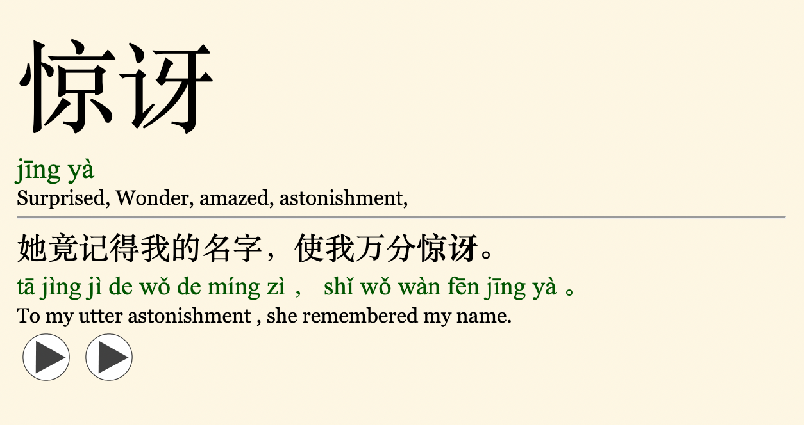

# chinese-dict-to-anki
Automatically create anki cards using youdao's API. This uses anki flashcards with the following fields: Simplified, Pinyin, Meaning, Audio, Sentence Simplified, Sentence Meaning, Sentence Audio. The audio files should be generated in AwesomeTTS in Anki. I use the Microsoft Azure Chinese Mandarin Female standard huihui voice.

This script will take a csv (chinese.csv) and take the first column as Chinese characters to search youdao.com's dictionary. It will then create a new csv with the above fields taking all of the definitions and using the first example sentece. You should then import it into Anki (File -> Import) and then use AwesomeTTS to generate the audio files.

To run: 
`python3 char-to-card.py`

Example card that's automatically created:

